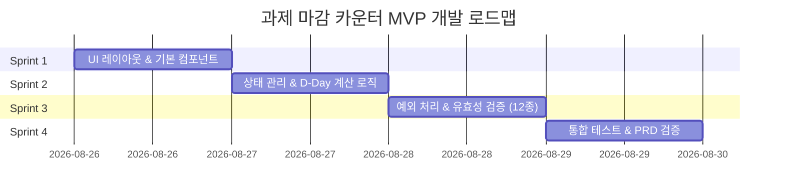

# 과제 마감 카운터 MVP 개발 계획서 (Development Plan)

> **문서 버전:** v1.0  
> **기반 문서:** [PRD (prd.md)](../prd.md)  
> **목적:** PRD 요구사항을 충실히 반영하고, 스프린트(Sprint) 단위로 단계별 개발 및 검증을 진행할 수 있는 상세 개발 계획서 작성

---

## 1. 프로젝트 개요 및 목표

### 1.1 목표
* 대학생이 과제명과 마감일을 입력하면 남은 기간을 D-Day 형태로 즉시 확인할 수 있는 **단일 화면 서비스** 개발.
* 데이터베이스 저장, 로그인 등의 복잡한 백엔드 없이 **단일 화면 내 프론트엔드 상태 관리**로 MVP 기능 구현 완료.

### 1.2 핵심 사용자 스토리
> *"대학생으로서 과제명과 마감일을 입력해 남은 날짜를 D-Day로 확인하고 싶다. 그래야 과제 마감이 얼마나 남았는지 빠르게 파악할 수 있다."*

### 1.3 제약 및 제외 범위 (Out of Scope)
* **제외 대상:** 회원가입/로그인, 결제/구독, DB/서버 저장, 새로고침 후 데이터 유지(LocalStorage 포함하지 않음), 과목 분류, 시간표/캘린더 연동, 알림/이메일/푸시, 과제 파일 업로드, 공유, 수정/삭제/완료 체크 기능.

---

## 2. 스프린트 단위 개발 계획 (Sprint Roadmap)

전체 개발은 **4개의 스프린트**로 분할하여 진행하며, 각 스프린트 종료 시 동작 가능한 버전을 검증합니다.



---

### 🏃 Sprint 1: 단일 화면 UI 레이아웃 및 기본 컴포넌트 구축
> **목표:** PRD 화면 명세(A~C)에 맞춘 레고 블록 형태의 단일 화면 레이아웃 완성

#### 1.1 컴포넌트 구조 정의
* 단일 화면 (`app/page.tsx` 및 `components/deadline-counter.tsx`)
  * **Header Section (헤더 영역):**
    * 타이틀: `과제 마감 카운터`
    * 서브문구: `마감일까지 얼마나 남았는지 확인해보세요.`
  * **Assignment Form Section (과제 등록 영역):**
    * 과제명 입력창 (Single-line input, max 50자) + 글자 수 카운터 (`0 / 50`)
    * 마감일 선택 입력창 (Date picker)
    * 등록 버튼 (`과제 등록`)
  * **Assignment List Section (과제 표시 영역):**
    * 과제 카드 리스트 컨테이너
    * 빈 상태(Empty State) 안내 영역

#### 1.2 Deliverables (산출물)
* [x] 헤더, 입력 폼, 리스트/빈 상태 UI 와이어프레임 구현
* [x] Tailwind CSS / Vanilla CSS 기반의 현대적이고 깔끔한 단일 화면 디자인 적용

---

### 🏃 Sprint 2: 데이터 상태 관리 & D-Day 핵심 로직 개발
> **목표:** 입력값을 받아 인메모리(React State) 상태로 관리하고, 정확한 D-Day를 계산하여 카드 형태로 렌더링

#### 2.1 데이터 구조 정의
```typescript
interface Assignment {
  id: string;          // 고유 식별자 (타임스탬프 또는 UUID)
  title: string;       // 과제명 (앞뒤 공백 제거된 상태)
  dueDate: string;     // YYYY-MM-DD 형식 마감일
}
```

#### 2.2 D-Day 계산 로직 구현 (`lib/utils.ts` 또는 헬퍼 함수)
* 기준일: 등록/조회 시점의 자정 (00:00:00) 기준
* 마감일: 마감 날짜 자정 (00:00:00) 기준
* 계산 규칙:
  * 마감일 > 오늘: `D-${남은 일수}` (예: `D-7`, `D-1`)
  * 마감일 == 오늘: `D-Day` (PRD 규정: `D-0`으로 표시하지 않음)
  * 과거 날짜: 입력 불허 (Sprint 3 유효성 검증에서 차단)

#### 2.3 Deliverables (산출물)
* [x] 과제 등록 시 React State에 과제 추가 기능 구현
* [x] D-Day 계산 함수 유닛 테스트 및 카드 렌더링 연결
* [x] 정상 등록 시 입력 폼 초기화 로직 구현

---

### 🏃 Sprint 3: 예외 처리 및 유효성 검증 구현 (PRD 섹션 5 전수 반영)
> **목표:** PRD에 명시된 12가지 예외 상황 및 유효성 검증 조건을 완벽히 처리하여 에러 방지

#### 3.1 예외 처리 사양서 및 체크리스트
| 번호 | 예외 상황 | 처리 조건 및 오류 메시지 | 구현 세부사항 |
| :--- | :--- | :--- | :--- |
| **5-1** | 과제명 미입력 | `과제명을 입력해주세요.` | 마감일 입력값은 유지, 과제명 필드 아래 레드 에러 메시지 표시 |
| **5-2** | 과제명 공백 입력 | `과제명을 입력해주세요.` | `trim()` 처리 후 빈 문자열 판단. 입력값 앞뒤 공백 자동 제거하여 저장 |
| **5-3** | 50자 초과 입력 | 글자 수 제한 (`32 / 50`) | `maxLength={50}` 설정 및 50자 초과 입력 블로킹 |
| **5-4** | 마감일 미선택 | `마감일을 선택해주세요.` | 입력된 과제명은 유지, 날짜 필드 아래 에러 메시지 표시 |
| **5-5** | 지난 날짜 선택 | `지난 날짜는 마감일로 등록할 수 없습니다.` | 오늘 이전 날짜 등록 차단, 과제명 유도 유지 |
| **5-6** | 오늘 날짜 선택 | 정상 등록 & `D-Day` 표시 | 에러 없이 등록하고 카드에 `D-Day` 문구 표기 |
| **5-7** | 다중 입력 오류 | 각 필드별 독립 에러 메시지 표시 | 과제명/마감일 개별 검증 후 오류 항목마다 에러 문구 동시 노출 |
| **5-8** | 버튼 연타 | 중복 등록 방지 | 제출 처리 중 버튼 비활성화(`disabled`) 및 디바운스 적용 |
| **5-9** | 동일 과제명+마감일 | `이미 등록된 과제입니다.` | 기존 목록 검색 후 중복 시 등록 차단 및 메시지 안내 |
| **5-10**| 동일 과제명+다른 마감일| 정상 등록 허용 | 과제명 동일해도 날짜 다르면 별도 과제로 판단하여 등록 |
| **5-11**| 등록 성공/실패 후 처리| 성공 시 전면 초기화, 실패 시 유효한 값 유지 | 성공 시 과제명/날짜/에러 리셋, 실패 시 정상 입력 필드는 온전히 보존 |
| **5-12**| 과제 0개 상태 (Empty) | `등록된 과제가 없습니다.`<br>`마감일을 확인할 과제를 등록해보세요.` | 과제 카드가 0개일 때 빈 상태 뷰 노출, 첫 과제 등록 시 카드 뷰 교체 |

#### 3.2 Deliverables (산출물)
* [x] 폼 에러 상태(`errors` object) 관리 구현
* [x] 12개 예외 케이스 동작 확인 및 UI 에러 텍스트 스타일링

---

### 🏃 Sprint 4: 통합 테스트, QA 및 PRD 완료 조건 검증
> **목표:** PRD 섹션 6의 25개 체크리스트 항목에 대해 최종 수동/자동 검증 완료

#### 4.1 최종 PRD 완료 조건 검증 체크리스트 (25개 항목)
* [x] 1. 화면은 하나만 존재한다.
* [x] 2. 별도의 페이지 이동이 없다.
* [x] 3. 과제명을 입력할 수 있다.
* [x] 4. 과제명은 최대 50자로 제한된다.
* [x] 5. 마감일을 선택할 수 있다.
* [x] 6. `과제 등록` 버튼이 존재한다.
* [x] 7. 정상 입력 후 과제 카드가 생성된다.
* [x] 8. 카드에 과제명이 표시된다.
* [x] 9. 카드에 마감일이 표시된다.
* [x] 10. 카드에 D-Day가 표시된다.
* [x] 11. 마감일이 오늘이면 `D-Day`로 표시된다.
* [x] 12. 과거 날짜는 등록할 수 없다.
* [x] 13. 과제명이 비어 있으면 등록할 수 없다.
* [x] 14. 공백만 입력한 과제명은 등록할 수 없다.
* [x] 15. 같은 과제명과 같은 날짜의 중복 등록을 막는다.
* [x] 16. 연속 클릭으로 동일한 과제가 여러 번 생성되지 않는다.
* [x] 17. 정상 등록 후 입력값이 초기화된다.
* [x] 18. 등록 실패 시 정상적으로 입력된 값은 유지된다.
* [x] 19. 등록된 과제가 없을 때 빈 상태 문구가 표시된다.
* [x] 20. 로그인 기능이 없다.
* [x] 21. 결제 기능이 없다.
* [x] 22. 데이터베이스를 사용하지 않는다.
* [x] 23. 새로고침 후 데이터 유지 기능을 만들지 않는다.
* [x] 24. 반응형 UI 레이아웃 검증 (모바일/데스크톱 대응)
* [x] 25. 코드 리팩토링 및 번들 최적화

---

### 🏃 Sprint 5: Gemini AI 기반 지능형 과제 서비스 연동
> **목표:** Google Gemini API (`gemini-3.6-flash`)를 연동하여 AI 자연어 과제 입력 및 과제 세부 실행 가이드 자동 생성 기능 구축

#### 5.1 Deliverables (산출물)
* [x] Next.js App Router 백엔드 API 엔드포인트 (`app/api/ai/route.ts`) 구현
* [x] Google Gemini API (`gemini-3.6-flash`) 연동 및 안전한 환경변수(`GEMINI_API_KEY`) 보안 설정
* [x] AI 자연어 파서 기능 구현 (자연어 입력 -> 과제명, 마감일 자동 파싱 및 폼 바인딩)
* [x] AI 과제 실행 가이드 기능 구현 (D-Day 맞춤 조언, 오늘 할 일, 3단계 추천 실행 체크리스트)
* [x] 프론트엔드 UI/UX 통합 (`components/deadline-counter.tsx` 및 `app/globals.css` AI 스타일링)

---

## 3. 개발 가이드라인 및 진행 절차

1. **스프린트 진행 방법:**
   - 각 스프린트별로 개발을 완료한 후 빌드 및 수동 테스트를 거칩니다.
   - 예외 처리 조건(Sprint 3)은 테스트 케이스 작성 후 꼼꼼히 확인합니다.
2. **문서 유지관리:**
   - 본 문서는 `doc/DEVELOPMENT_PLAN.md`에 보관하며, 변경 요구사항이 발생할 경우 버전 업데이트를 진행합니다.

