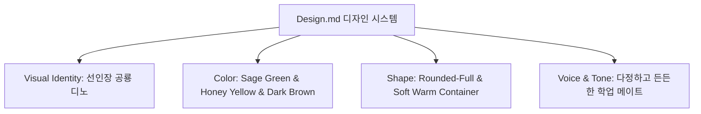

# 선인장 공룡 '디노' 테마 톤앤매너 전면 개편 계획서 (Redesign Plan)

> **문서 버전:** v1.0  
> **기반 디자인 가이드:** [`Design.md`](../Design.md)  
> **목적:** 기존의 기계적이고 차가운 톤을 탈피하여, 대학생 사용자에게 친근하고 따뜻한 격려를 전하는 **선인장 공룡 '디노(Dino)' 비주얼 아이덴티티 및 웜 파스텔 디자인 시스템**으로 전면 개편

---

## 1. 🎨 디자인 핵심 방향성 & 브랜드 아이덴티티

### 1.1 브랜드 성격 (Brand Personality)
- **친근한(Friendly) & 귀여운(Adorable):** 뾰족하지만 사랑스러운 분홍 꽃을 단 선인장 공룡 '디노'
- **든든한(Reliable) & 고무적인(Encouraging):** "디노가 꼼꼼히 챙겨줄게요!", "오늘도 차근차근 해내봐요!"
- **톤앤보이스:** 딱딱한 에러/시스템 문구를 배제하고 따뜻한 구어체 및 디노의 말풍선 메시지 제공.

---

## 2. 🌈 컬러 & 타이포그래피 시스템 개편

### 2.1 Color Palette 매핑
| 토큰명 | 색상 코드 | 용도 및 매핑 |
| :--- | :--- | :--- |
| **Background** | `#FBF9F8` | 종이 질감의 편안한 웜 오프화이트 배경 |
| **Card / Container** | `#FFFFFF` / `#F4EFEA` | 부드러운 크림 화이트 카드 컨테이너 |
| **Text Primary** | `#5D4037` | 다크 브라운 (차분하고 따뜻한 가독성 확보) |
| **Text Muted** | `#8D6E63` / `#A1887F` | 소프트 웜 브라운 보조 텍스트 |
| **Primary (Sage Green)** | `#A8D19D` | 선인장 공룡 메인 컬러, 안정감과 눈의 힐링 |
| **Secondary (Honey Yellow)**| `#FFB84D` | 핵심 액션 버튼(과제 등록), 따뜻한 에너지 |
| **Point (Cactus Pink)** | `#FF8A80` | 선인장 꽃 핑크, D-Day 긴급 알림, 포인트 뱃지 |

### 2.2 Typography & Scale
- **웹폰트 적용:** `Bricolage Grotesque` (영문/숫자 헤딩) + `Apple SD Gothic Neo / Pretendard` (국문 가독성)
- **Heading 1:** 32px / Bold (디노의 환영 타이틀)
- **Heading 2:** 22~24px / Semi-Bold (새 과제 등록 & 과제 리스트)
- **Body & Label:** 14~16px / Soft Medium

---

## 3. 🧩 단계별 개편 스프린트 계획

### 🏃 Phase 1: 디자인 토큰 & 글로벌 CSS 개편 ([`app/globals.css`](file:///c:/v0test/app/globals.css))
- [ ] `:root` 변수를 `Design.md`의 Sage Green, Honey Yellow, Dark Brown, Cactus Pink 팔레트로 전면 교체
- [ ] `Rounded-3xl`, `Rounded-full` 기반의 극대화된 둥근 UI 컴포넌트 유틸리티 작성
- [ ] 퐁당퐁당 부유 애니메이션(`@keyframes dino-float`) 및 펄스(`@keyframes dino-pulse`) 구현
- [ ] 소프트 섀도우(`box-shadow: 0 12px 32px rgba(93, 64, 55, 0.06)`) 적용

### 🏃 Phase 2: 선인장 공룡 '디노' 마스코트 에셋 및 헤더/히어로 구축
- [ ] 귀여운 선인장 공룡 디노 SVG 캐릭터 컴포넌트 (`components/cactus-dino.tsx`) 제작
  - 분홍색 꽃을 머리에 얹고 연초록 몸체와 작은 가시를 가진 3D/플랫 스타일의 디노
- [ ] 상단 히어로 영역에 디노 마스코트 부유 모션과 따뜻한 환영 말풍선 배치

### 🏃 Phase 3: 입력 폼 & 과제 카드 & AI 가이드 톤앤매너 리디자인 ([`components/deadline-counter.tsx`](file:///c:/v0test/components/deadline-counter.tsx))
- [ ] **새 과제 등록 폼:** Honey Yellow 버튼, 부드러운 둥근 인풋 필드, 디노 AI 빠른 입력 탭
- [ ] **과제 카드 리디자인:**
  - D-Day 및 긴급도 뱃지를 Cactus Pink & Sage Green 파스텔 톤으로 재구성
  - D-Day 위험도 게이지를 귀여운 씨앗/새싹/꽃 봉오리 게이지로 감성화
- [ ] **AI 학습 가이드:** 디노가 건네주는 맞춤 코칭 노트 형태로 카드 디자인 개편 ("디노의 응원 한마디", "오늘 할 일", "3단계 퀘스트")
- [ ] **인터랙티브 체크리스트:** 디노 발자국/꽃 모양의 귀여운 인터랙티브 체크박스

### 🏃 Phase 4: 배포 및 동작 검증
- [ ] 로컬 빌드(`next build`) 및 린트 검증
- [ ] Vercel 클라우드 프로덕션 재배포 및 라이브 확인

---

## 4. 📋 수정 대상 파일 목록
1. **[`Design.md`](file:///c:/v0test/Design.md)**: 디자인 시스템 레퍼런스
2. **[`app/globals.css`](file:///c:/v0test/app/globals.css)**: 웜 파스텔 컬러, 부유 애니메이션, 둥근 컴포넌트 스타일
3. **[`components/cactus-dino.tsx`](file:///c:/v0test/components/cactus-dino.tsx)** [NEW]: 선인장 공룡 '디노' 캐릭터 & 감정 모션 컴포넌트
4. **[`components/deadline-counter.tsx`](file:///c:/v0test/components/deadline-counter.tsx)**: 전체 UI 및 텍스트 톤앤보이스 전면 개편
5. **[`doc/DEVELOPMENT_PLAN.md`](file:///c:/v0test/doc/DEVELOPMENT_PLAN.md)** & **[`prd.md`](file:///c:/v0test/prd.md)**: 디자인 개편 내역 반영
